# UML Diagrams — Cubic Gaming Lounge Rental System

> Dihasilkan dari analisis migration, models, controllers, dan services project `rental-ps`.

---

## 1. Use Case Diagram

```mermaid
%%{init: {'theme': 'base', 'themeVariables': {'primaryColor': '#1e3a5f', 'primaryTextColor': '#fff', 'primaryBorderColor': '#2d6a9f', 'lineColor': '#aaa', 'background': '#0d1b2a'}}}%%
graph LR
    Admin(["👤 Admin"])
    Operator(["👤 Operator"])
    System(["⚙️ System"])

    subgraph UC_AUTH ["🔐 Authentication"]
        UC1["Login"]
        UC2["Logout"]
        UC3["Edit Profile"]
    end

    subgraph UC_MASTER ["📦 Master Data Management"]
        UC4["Kelola Karyawan (CRUD)"]
        UC5["Kelola Console (CRUD)"]
        UC6["Kelola Game (CRUD)"]
        UC7["Kelola FnB Item (CRUD)"]
        UC8["Kelola FnB Addon (CRUD)"]
        UC9["Kelola Package (CRUD)"]
    end

    subgraph UC_RENTAL ["🎮 Rental Management"]
        UC10["Mulai Rental Baru"]
        UC11["Lihat Detail Rental (Live)"]
        UC12["Tambah Waktu (Extension)"]
        UC13["Tambah FnB ke Rental"]
        UC14["Hapus FnB dari Rental"]
        UC15["Selesaikan Rental (Finish)"]
        UC16["Bayar Rental"]
        UC17["Cetak Struk (Receipt)"]
        UC18["Lihat Riwayat Rental"]
        UC19["Ekspor Riwayat ke CSV"]
    end

    subgraph UC_RESERVATION ["📅 Reservation Management"]
        UC20["Buat Reservasi"]
        UC21["Update Reservasi"]
        UC22["Batalkan Reservasi"]
        UC23["Konversi Reservasi → Rental"]
    end

    subgraph UC_FNB ["🍔 FnB Order Standalone"]
        UC24["Buat Order FnB"]
        UC25["Lihat Detail Order FnB"]
        UC26["Bayar Order FnB"]
        UC27["Batalkan Order FnB"]
    end

    subgraph UC_CASH ["💰 Keuangan"]
        UC28["Catat Pengeluaran Kas"]
        UC29["Lihat Riwayat Pengeluaran"]
        UC30["Edit Pengeluaran Kas"]
        UC31["Hapus Pengeluaran Kas"]
    end

    subgraph UC_DASHBOARD ["📊 Dashboard & Monitor"]
        UC32["Lihat Dashboard (Ringkasan)"]
        UC33["Monitor Rental Aktif (Live)"]
        UC34["Room Monitor"]
    end

    Admin --> UC1
    Admin --> UC2
    Admin --> UC3
    Admin --> UC4
    Admin --> UC5
    Admin --> UC6
    Admin --> UC7
    Admin --> UC8
    Admin --> UC9
    Admin --> UC18
    Admin --> UC19
    Admin --> UC29
    Admin --> UC30
    Admin --> UC31
    Admin --> UC32

    Operator --> UC1
    Operator --> UC2
    Operator --> UC3
    Operator --> UC10
    Operator --> UC11
    Operator --> UC12
    Operator --> UC13
    Operator --> UC14
    Operator --> UC15
    Operator --> UC16
    Operator --> UC17
    Operator --> UC18
    Operator --> UC20
    Operator --> UC21
    Operator --> UC22
    Operator --> UC23
    Operator --> UC24
    Operator --> UC25
    Operator --> UC26
    Operator --> UC27
    Operator --> UC28
    Operator --> UC32
    Operator --> UC33
    Operator --> UC34

    System --> UC33
```

---

## 2. ERD (Entity Relationship Diagram)

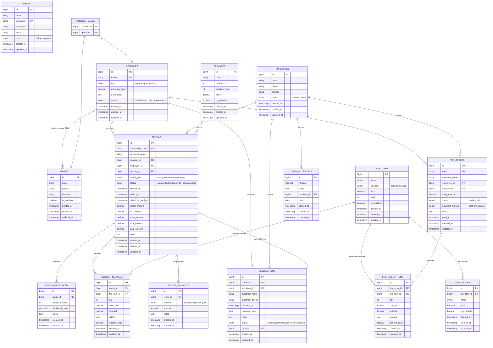

---

## 3. Class Diagram

```mermaid
classDiagram
    direction TB

    class User {
        +bigint id
        +string nama
        +string username
        +string email
        +string password
        +string role
        +timestamps()
    }

    class Employee {
        +bigint id
        +string name
        +string phone
        +string position
        +string status
        +softDeletes()
        +rentals() HasMany
        +reservations() HasMany
        +fnbOrders() HasMany
        +cashOutbounds() HasMany
    }

    class Console {
        +bigint id
        +string name
        +string type
        +decimal price_per_hour
        +string description
        +string status
        +softDeletes()
        +games() BelongsToMany
        +rentals() HasMany
        +activeRental() HasOne
        +reservations() HasMany
        +fnbOrders() HasMany
    }

    class Game {
        +bigint id
        +string name
        +string genre
        +string platform
        +bool is_available
        +softDeletes()
        +consoles() BelongsToMany
    }

    class Package {
        +bigint id
        +string name
        +text description
        +int duration_hours
        +decimal price
        +bool is_available
        +softDeletes()
        +rentals() HasMany
    }

    class Rental {
        +bigint id
        +string transaction_code
        +string customer_name
        +bigint console_id
        +bigint employee_id
        +bigint package_id
        +string rental_type
        +string status
        +datetime started_at
        +datetime ended_at
        +datetime scheduled_end_at
        +decimal rental_amount
        +decimal fnb_amount
        +decimal extra_amount
        +decimal total_amount
        +decimal paid_amount
        +text notes
        +softDeletes()
        +console() BelongsTo
        +employee() BelongsTo
        +package() BelongsTo
        +extensions() HasMany
        +fnbItems() HasMany
        +payments() HasMany
        +getDurationMinutesAttribute() int
        +getRemainingMinutesAttribute() int
        +getIsOvertimeAttribute() bool
        +recalculateTotal() void
    }

    class RentalExtension {
        +bigint id
        +bigint rental_id
        +int added_minutes
        +decimal additional_price
        +text notes
        +timestamps()
        +rental() BelongsTo
    }

    class RentalPayment {
        +bigint id
        +bigint rental_id
        +string method
        +decimal amount
        +text notes
        +timestamps()
        +rental() BelongsTo
    }

    class FnbItem {
        +bigint id
        +string name
        +string category
        +decimal price
        +int stock
        +bool is_available
        +softDeletes()
        +addons() HasMany
        +rentalFnbItems() HasMany
        +orderItems() HasMany
    }

    class FnbAddon {
        +bigint id
        +bigint fnb_item_id
        +string name
        +decimal price
        +bool is_available
        +softDeletes()
        +fnbItem() BelongsTo
    }

    class RentalFnbItem {
        +bigint id
        +bigint rental_id
        +bigint fnb_item_id
        +int qty
        +decimal unit_price
        +decimal subtotal
        +json addons
        +decimal addons_price
        +timestamps()
        +rental() BelongsTo
        +fnbItem() BelongsTo
    }

    class FnbOrder {
        +bigint id
        +string code
        +string customer_name
        +bigint employee_id
        +bigint console_id
        +decimal total_amount
        +string status
        +string payment_method
        +text notes
        +datetime paid_at
        +timestamps()
        +employee() BelongsTo
        +console() BelongsTo
        +items() HasMany
    }

    class FnbOrderItem {
        +bigint id
        +bigint fnb_order_id
        +bigint fnb_item_id
        +int qty
        +decimal unit_price
        +decimal subtotal
        +json addons
        +decimal addons_price
        +timestamps()
        +fnbOrder() BelongsTo
        +fnbItem() BelongsTo
    }

    class Reservation {
        +bigint id
        +bigint console_id
        +bigint employee_id
        +string customer_name
        +string customer_phone
        +datetime reserved_at
        +float duration_hours
        +text notes
        +string status
        +bigint rental_id
        +timestamps()
        +console() BelongsTo
        +employee() BelongsTo
        +rental() BelongsTo
    }

    class CashOutbound {
        +bigint id
        +decimal nominal
        +text notes
        +bigint employee_id
        +date date
        +softDeletes()
        +employee() BelongsTo
    }

    class RentalService {
        +create(array data) Rental
        +addTime(Rental rental, array data) RentalExtension
        +addFnb(Rental rental, array items) void
        +finish(Rental rental) Rental
        +pay(Rental rental, array payments) void
        +getActiveRentals() Collection
        +getFinishedUnpaidRentals() Collection
    }

    class DashboardService {
        +getSummary() array
        +getActiveRentals() Collection
    }

    %% Controller Classes
    class RentalController {
        -RentalService rentalService
        +index() Response
        +store(Request) RedirectResponse
        +show(Rental) Response
        +addTime(Request, Rental) RedirectResponse
        +addFnb(Request, Rental) RedirectResponse
        +removeFnb(Rental, RentalFnbItem) RedirectResponse
        +finish(Rental) RedirectResponse
        +payment(Rental) Response
        +pay(Request, Rental) RedirectResponse
        +receipt(Rental) Response
        +history(Request) Response
        +exportExcel(Request) StreamedResponse
    }

    class FnbOrderController {
        +index() Response
        +store(Request) RedirectResponse
        +show(FnbOrder) Response
        +pay(Request, FnbOrder) RedirectResponse
        +destroy(FnbOrder) RedirectResponse
    }

    class ReservationController {
        -RentalService rentalService
        +index(Request) Response
        +store(Request) RedirectResponse
        +update(Request, Reservation) RedirectResponse
        +destroy(Reservation) RedirectResponse
        +convert(Reservation) RedirectResponse
    }

    %% Relationships
    Console "1" --> "*" Rental : has many
    Console "1" --> "*" Reservation : has many
    Console "1" --> "*" FnbOrder : has many
    Console "*" --> "*" Game : M:N via console_games

    Employee "1" --> "*" Rental : operates
    Employee "1" --> "*" Reservation : handles
    Employee "1" --> "*" FnbOrder : creates
    Employee "1" --> "*" CashOutbound : records

    Package "1" --> "*" Rental : used by

    Rental "1" --> "*" RentalExtension : extended by
    Rental "1" --> "*" RentalFnbItem : has FnB items
    Rental "1" --> "*" RentalPayment : paid through
    Rental "1" --> "0..1" Reservation : converted from

    FnbItem "1" --> "*" FnbAddon : has addons
    FnbItem "1" --> "*" RentalFnbItem : ordered in
    FnbItem "1" --> "*" FnbOrderItem : ordered as

    FnbOrder "1" --> "*" FnbOrderItem : contains

    RentalController ..> RentalService : uses
    ReservationController ..> RentalService : uses
```

---

## 4. Sequence Diagram — Mulai Rental Baru

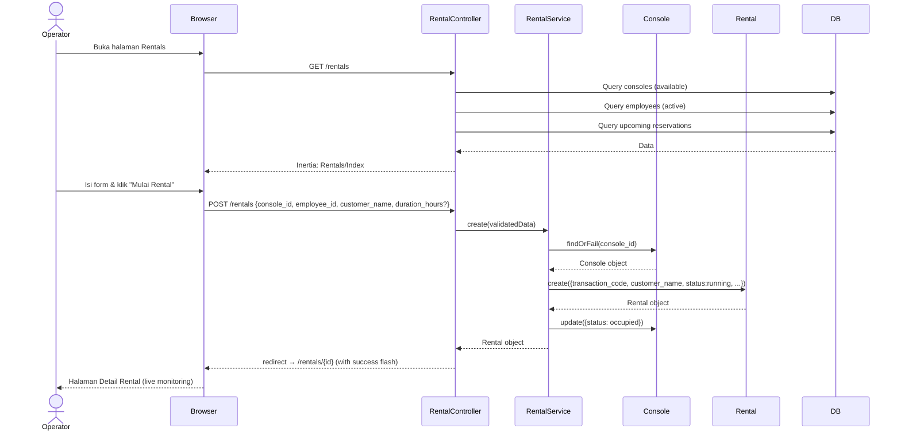

---

## 5. Sequence Diagram — Selesaikan & Bayar Rental

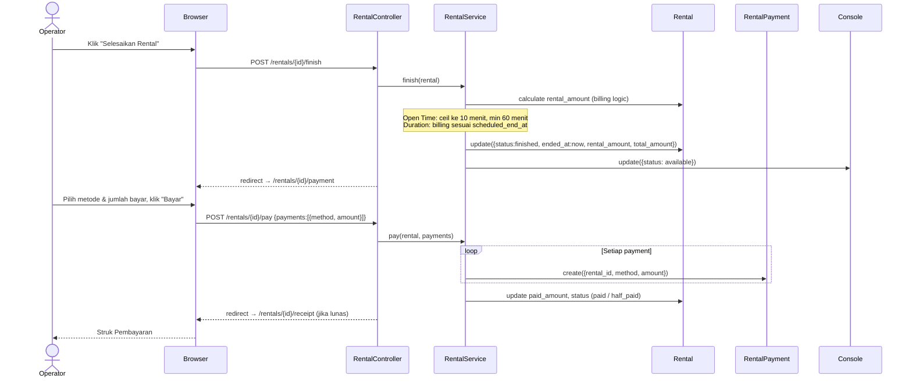

---

## 6. Sequence Diagram — FnB Order Standalone

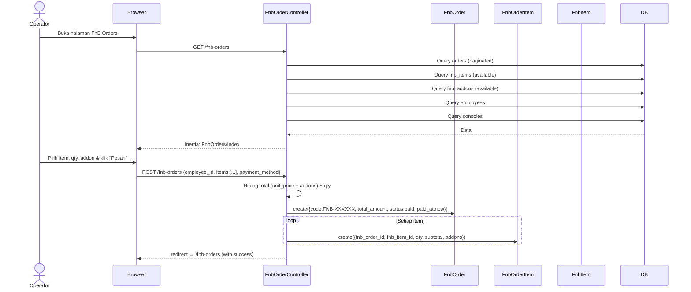

---

## 7. Sequence Diagram — Konversi Reservasi ke Rental

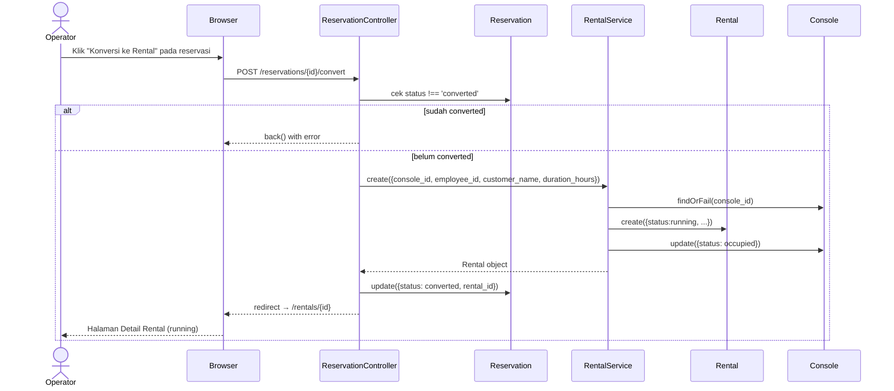

---

## 8. Activity Diagram — Proses Rental (Lengkap)

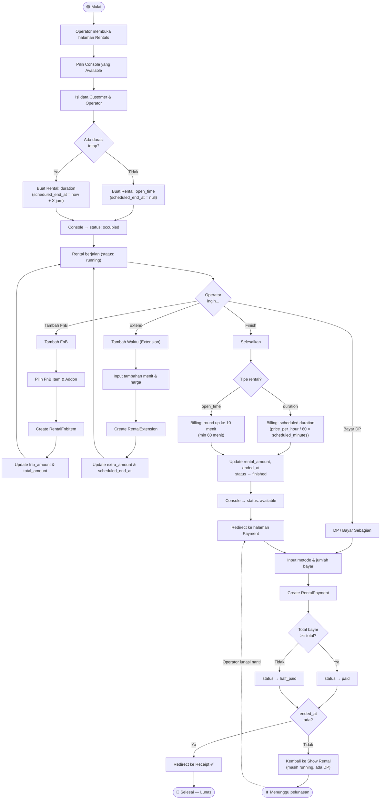

---

## 9. Activity Diagram — FnB Order Standalone

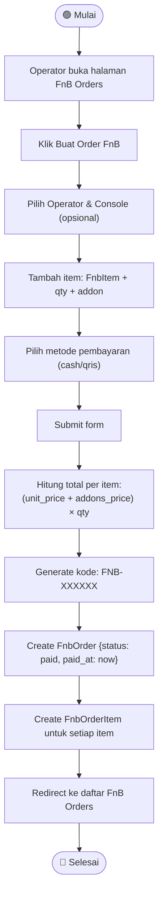

---

## 10. State Machine Diagram — Rental Status

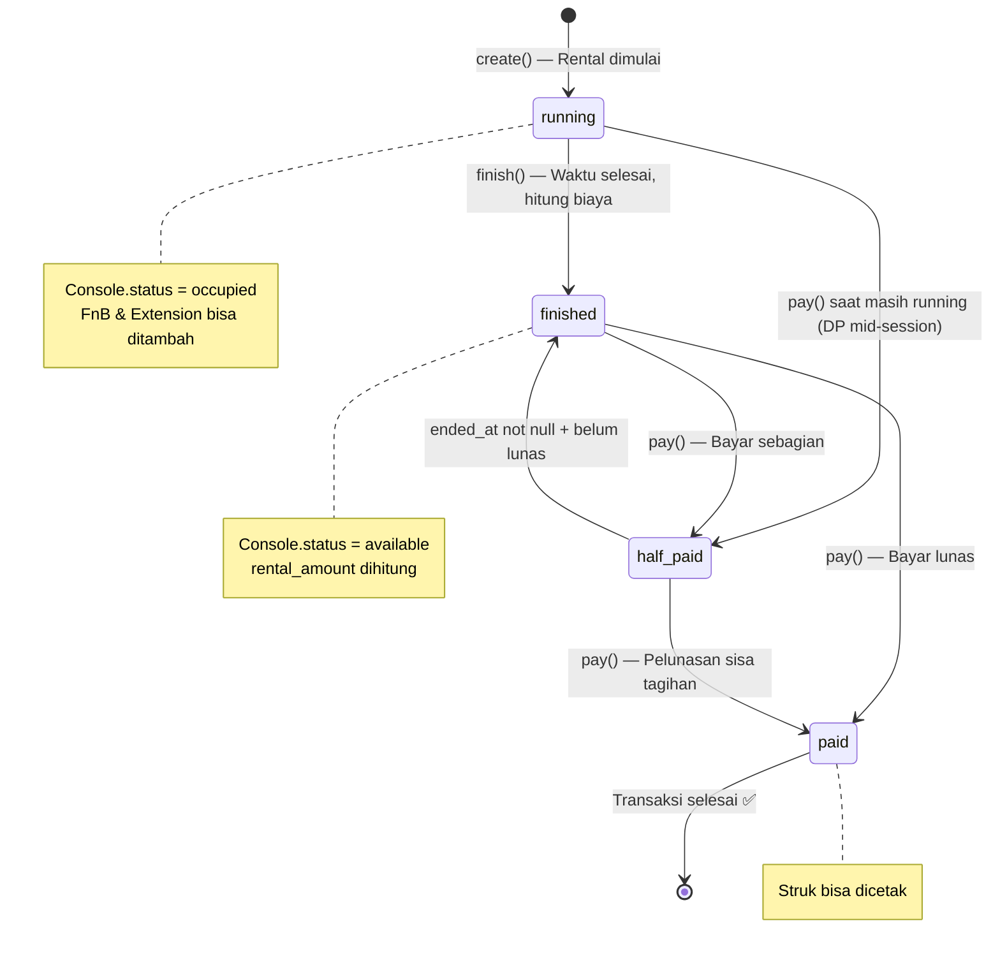

---

## 11. State Machine Diagram — Reservation Status

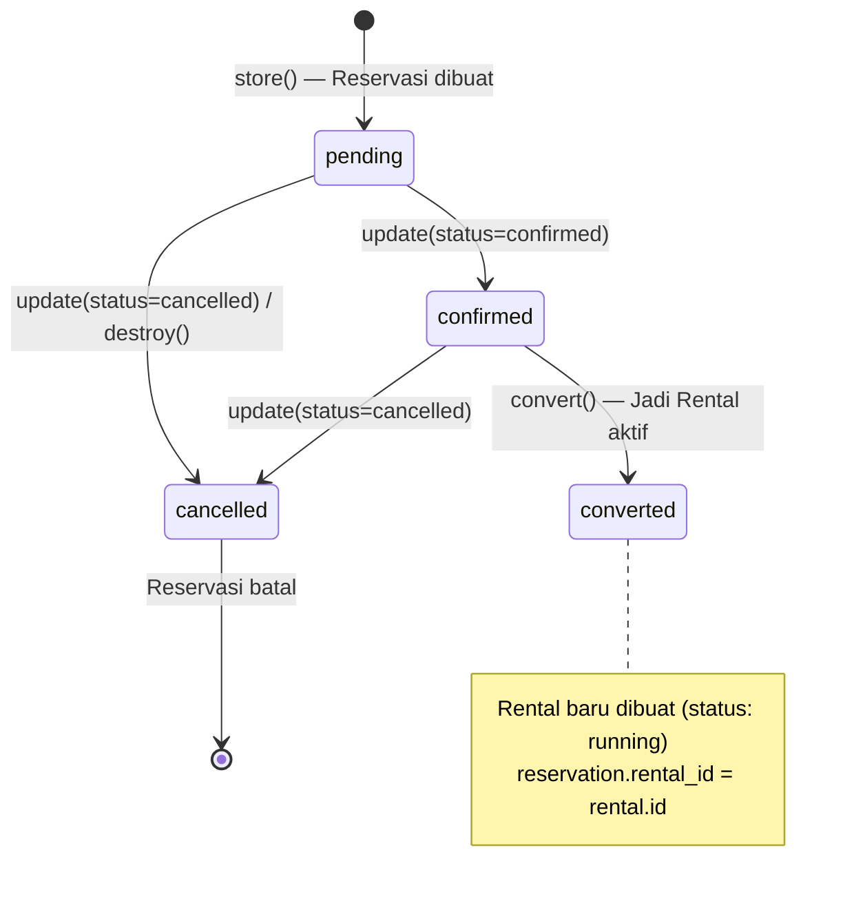

---

## 12. Component Diagram

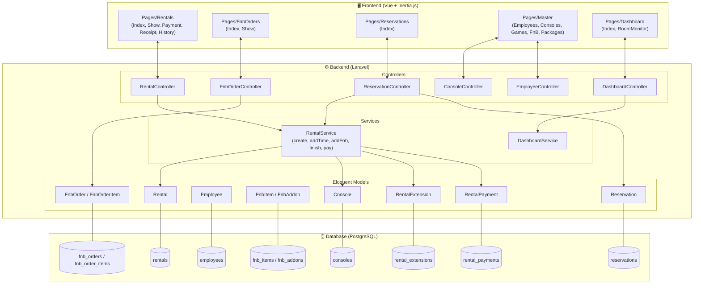

---

## Ringkasan Sistem

| Entitas | Tabel | Model | Relasi Utama |
|---|---|---|---|
| User | `users` | `User` | - |
| Karyawan | `employees` | `Employee` | hasMany: Rental, Reservation, FnbOrder, CashOutbound |
| Console | `consoles` | `Console` | belongsToMany: Game; hasMany: Rental, Reservation, FnbOrder |
| Game | `games` | `Game` | belongsToMany: Console |
| Paket | `packages` | `Package` | hasMany: Rental |
| Rental | `rentals` | `Rental` | belongsTo: Console, Employee, Package; hasMany: Extension, FnbItem, Payment |
| Perpanjangan | `rental_extensions` | `RentalExtension` | belongsTo: Rental |
| Pembayaran | `rental_payments` | `RentalPayment` | belongsTo: Rental |
| Item FnB | `fnb_items` | `FnbItem` | hasMany: FnbAddon, RentalFnbItem, FnbOrderItem |
| Addon FnB | `fnb_addons` | `FnbAddon` | belongsTo: FnbItem |
| FnB di Rental | `rental_fnb_items` | `RentalFnbItem` | belongsTo: Rental, FnbItem |
| Order FnB | `fnb_orders` | `FnbOrder` | belongsTo: Employee, Console; hasMany: FnbOrderItem |
| Item Order FnB | `fnb_order_items` | `FnbOrderItem` | belongsTo: FnbOrder, FnbItem |
| Reservasi | `reservations` | `Reservation` | belongsTo: Console, Employee, Rental |
| Pengeluaran Kas | `cash_outbounds` | `CashOutbound` | belongsTo: Employee |
